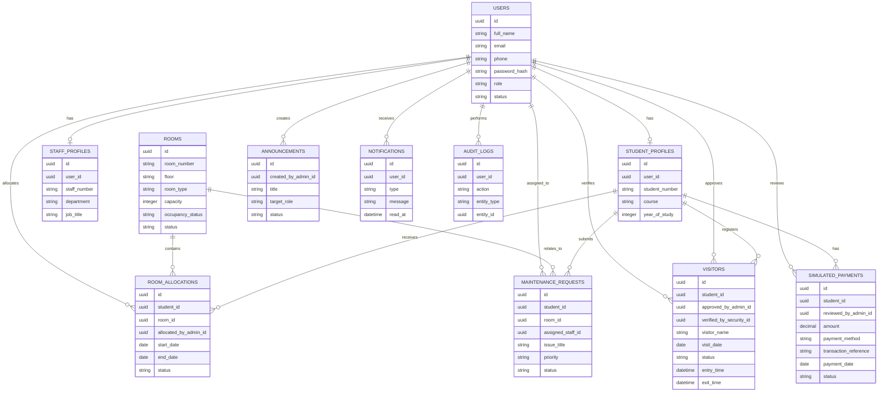

# Database and ER Design

This document describes the planned database model for the Smart Hostel Management System. It is a design document only. No database migrations, SQL tables, seed files, or application code are created at this stage.

## Design Goals

1. Keep user authentication separate from role-specific profile details.
2. Support four roles only: Student, Admin, Maintenance Staff, and Security Staff.
3. Keep room allocation controlled by Admin users.
4. Track visitor approval by Admin users and entry verification by Security Staff.
5. Support a simulated payment workflow without connecting to external payment providers.
6. Keep enough audit data to support reports and accountability.

## Proposed Entities

| Entity | Purpose |
| --- | --- |
| `users` | Stores login identity, role, account status, and shared user fields. |
| `student_profiles` | Stores student-only details linked to a user account. |
| `staff_profiles` | Stores staff-only details linked to a user account. |
| `rooms` | Stores room information, capacity, and availability status. |
| `room_allocations` | Stores Admin-controlled student room allocation history. |
| `maintenance_requests` | Stores maintenance issues, assignments, priorities, and status updates. |
| `visitors` | Stores visitor registration, Admin approval, and Security Staff entry verification. |
| `announcements` | Stores announcements created by Admin users. |
| `notifications` | Stores user-facing notifications such as allocation and announcement notices. |
| `simulated_payments` | Stores placeholder payment records for demonstration only. |
| `audit_logs` | Stores important user actions for accountability and reporting. |

## Proposed Entity Fields

These fields are planned for design discussion. Final field names and constraints should be confirmed before migrations are created.

### `users`

- `id`
- `full_name`
- `email`
- `phone`
- `password_hash`
- `role`
- `status`
- `created_at`
- `updated_at`

### `student_profiles`

- `id`
- `user_id`
- `student_number`
- `course`
- `year_of_study`
- `emergency_contact_name`
- `emergency_contact_phone`
- `created_at`
- `updated_at`

### `staff_profiles`

- `id`
- `user_id`
- `staff_number`
- `department`
- `job_title`
- `created_at`
- `updated_at`

### `rooms`

- `id`
- `room_number`
- `floor`
- `room_type`
- `capacity`
- `occupancy_status`
- `status`
- `created_at`
- `updated_at`

### `room_allocations`

- `id`
- `student_id`
- `room_id`
- `allocated_by_admin_id`
- `start_date`
- `end_date`
- `status`
- `notes`
- `created_at`
- `updated_at`

### `maintenance_requests`

- `id`
- `student_id`
- `room_id`
- `assigned_staff_id`
- `issue_title`
- `description`
- `priority`
- `status`
- `submitted_at`
- `assigned_at`
- `completed_at`
- `created_at`
- `updated_at`

### `visitors`

- `id`
- `student_id`
- `approved_by_admin_id`
- `verified_by_security_id`
- `visitor_name`
- `visitor_phone`
- `relationship`
- `visit_date`
- `purpose`
- `status`
- `entry_time`
- `exit_time`
- `created_at`
- `updated_at`

### `announcements`

- `id`
- `created_by_admin_id`
- `title`
- `message`
- `target_role`
- `status`
- `publish_at`
- `expires_at`
- `created_at`
- `updated_at`

### `notifications`

- `id`
- `user_id`
- `type`
- `message`
- `related_entity_type`
- `related_entity_id`
- `read_at`
- `created_at`

### `simulated_payments`

- `id`
- `student_id`
- `reviewed_by_admin_id`
- `amount`
- `payment_method`
- `transaction_reference`
- `payment_date`
- `status`
- `notes`
- `created_at`
- `updated_at`

### `audit_logs`

- `id`
- `user_id`
- `action`
- `entity_type`
- `entity_id`
- `details`
- `created_at`

## Planned Status Values

| Area | Status Values |
| --- | --- |
| User account | `active`, `inactive`, `suspended` |
| Room | `active`, `inactive`, `maintenance` |
| Room occupancy | `available`, `partially_occupied`, `full` |
| Room allocation | `active`, `ended`, `changed` |
| Maintenance request | `submitted`, `assigned`, `in_progress`, `completed`, `cancelled` |
| Visitor | `pending`, `approved`, `rejected`, `checked_in`, `checked_out` |
| Announcement | `draft`, `published`, `expired` |
| Simulated payment | `submitted`, `under_review`, `confirmed`, `rejected` |

## ER Diagram

## Data Rules to Confirm During Implementation

1. A student must have an active user account before receiving an active room allocation.
2. A room must not exceed its capacity.
3. Only Admin users can create, change, or end room allocations.
4. Students can view their own allocation but cannot allocate, book, or change rooms.
5. Only Admin users can approve or reject visitors.
6. Security Staff can verify approved visitors and record entry and exit times.
7. Simulated payment records must not trigger real money movement.
8. Important changes should create audit log records where appropriate.

## Report Data Sources

| Report | Main Data Sources | Example Filters |
| --- | --- | --- |
| Room availability report | `rooms`, `room_allocations` | room status, occupancy status, room type |
| Room occupancy report | `rooms`, `room_allocations` | room, status |
| Room allocation report | `room_allocations`, `rooms`, `student_profiles` | date, room, student, status |
| Student report | `users`, `student_profiles`, `room_allocations` | status, room, course |
| Maintenance request report | `maintenance_requests`, `rooms`, `student_profiles`, `staff_profiles` | date, status, room, assigned staff |
| Visitor report | `visitors`, `student_profiles`, `users` | date, status, student |
| Simulated payment report | `simulated_payments`, `student_profiles` | date, status, student |
| General dashboard statistics | all main operational entities | date, status |
