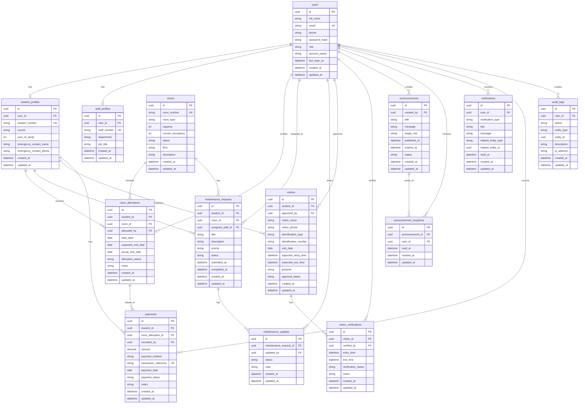

# ER Diagram

This document shows the planned entity relationships for the Smart Hostel Management System. It is a design document only. No SQL files, migrations, database tables, or generated database code are created from this diagram.

## Mermaid ER Diagram

## Relationship Notes

1. One user may have one student profile.
2. One user may have one staff profile.
3. One student may have many room allocations over time.
4. One room may have many room allocations over time.
5. One Admin user may create many room allocations.
6. One student may submit many maintenance requests.
7. One room may have many maintenance requests.
8. One Maintenance Staff user may be assigned many maintenance requests.
9. One maintenance request may have many maintenance updates.
10. One student may register many visitors.
11. One Admin user may approve many visitors.
12. One visitor may have one or more visitor verification records.
13. One Security Staff user may verify many visitor entries and exits.
14. One Admin user may create many announcements.
15. One announcement may have many announcement recipient records.
16. One user may receive many notifications.
17. One student may have many simulated payment records.
18. One room allocation may have many simulated payment records.
19. One user may create many audit log records.

## Important Design Notes

1. The ER diagram matches the planned tables in `database/documentation/database-design.md`.
2. Payment records are simulated records only.
3. The diagram does not include payment provider tables, card data, bank credentials, M-Pesa credentials, or external gateway callbacks.
4. Room allocation is controlled by Admin users.
5. Visitor approval is controlled by Admin users.
6. Visitor entry and exit verification is handled by Security Staff.
